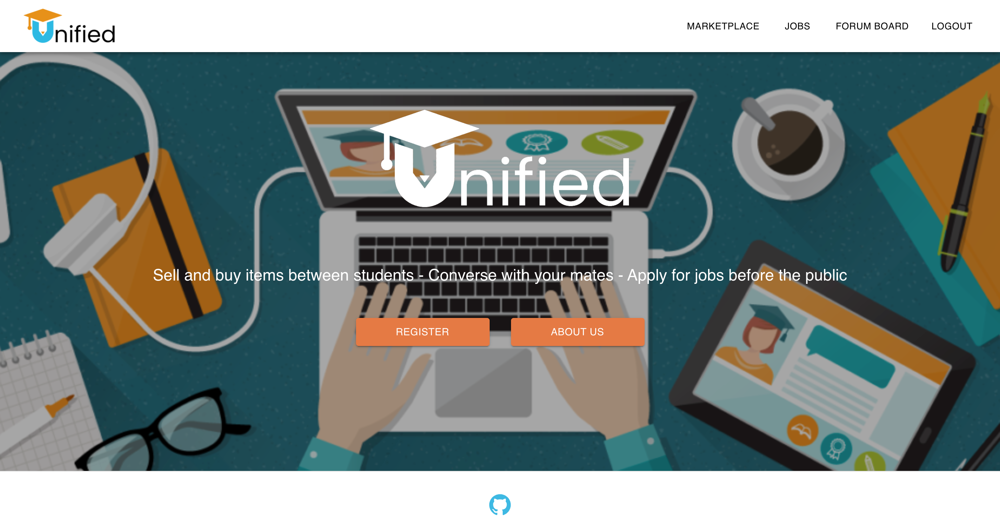
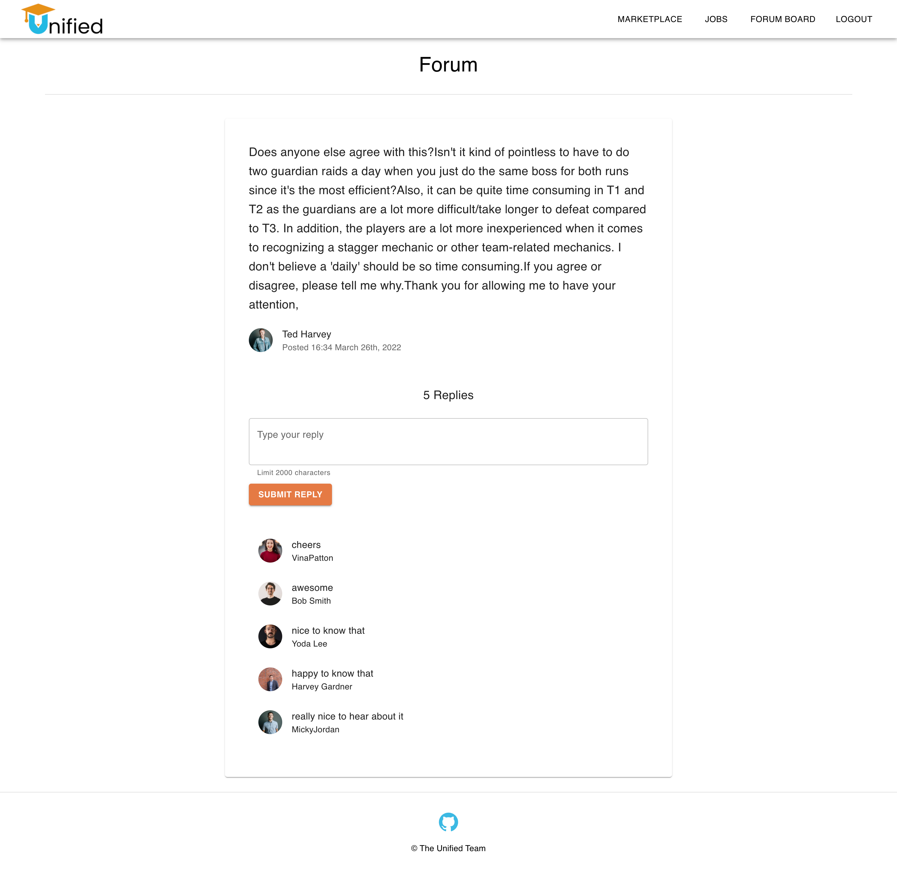

# UNIFIED

## Table Of Contents

- [Contributors](#contributors)
- [About The Project](#about-the-project)
  - [Project Links](#project-links)
  - [Technologies](#technologies)
- [Screenshots](#screenshots)

## Contributors

- [Kayle Rieger Patton](https://github.com/kayleriegerpatton)
- [Conor Kelly](https://github.com/conorjkelly96)
- [Liana Laurentiu](https://github.com/lianavaleria15)
- [Matt Palmer](https://github.com/tigerbath)
- [Sumaia Sorna](https://github.com/SumaiaSorna)
- [Yashemabeth Mcleod](https://github.com/Yashemabeth)

## About The Project

Unified is the one-stop-shop where university students can find career development opportunities, engage with and support each other, and make environmentally and financially sustainable choices.

### Project Links

View the [client repo](https://github.com/kayleriegerpatton/unified-client).

View the [server repo](https://github.com/kayleriegerpatton/unified-server).

### Technologies

#### Front End

- Apollo Client
- AWS
- JSONWebToken
- Material UI
- React

#### Back End

- Apollo GraphQL Server
- JavaScript
- Mongoose & MongoDB

## Screenshots

